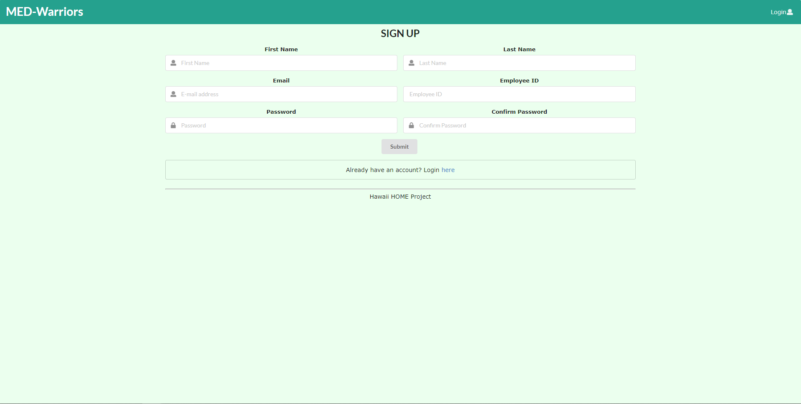

## Table of contents

* [Overview](#overview)
* [Deployment](#deployment)
* [User Guide](#user-guide)
* [Feedback](#feedback)
* [Developer Guide](#developer-guide)
* [Development History](#development-history)
* [Continuous Integration](#continuous-integration)
* [Team](#team)

## Overview
Med-Warriors is a real life application designed for clinics to use to keep track of essential mediciation. 

## Deployment
A live deployment of Med-Warriors is not yet available.

## User Guide
This section provides a walkthrough of the Med-Warriors user interface and its capabilities.

### Landing Page
The landing page is presented to users when they visit the top-level URL to the site.

### Sign in and Sign up
Click on the “Login” button in the upper right corner of the navbar, then select “Sign in” to go to the following page and login. You must have been previously registered with the system to use this option:

You can select “Sign up” to go to the following page and register as a new user:

### Medicine and Supplies Page
This page shows the current stored medicine and supplies with the detailed information.

### Input Page
For employees to input the medicine and supplies to storage.

### Low Inventory Report Page
This page shows a report to see if there is a low inventory and if they need to stock up.

### User Profile Page
Users have access to his/her personal information of the account, and are able to change/update information and password

### History Records Page
It shows all the changes of medicine and supplies in the storage with the detailed information(input and output).

### Patient Information Page
It shows a record of all patients who visited and have prescriptions, and with full detail of patient information and contact.

### Supplies Source Page
It shows the record of all inputted medicine and supplies with detailed information about the source.

### Input Page
For employees to input the medicine and supplies to storage.

### Prescription Page (Output)
For employees to issue prescriptions of medicine and supplies to patients. Preview of label for bottle. 

## Feedback
WIP

## Developer Guide
WIP

## Development History
The development process for BowFolios conformed to [Issue Driven Project Management](http://courses.ics.hawaii.edu/ics314f19/modules/project-management/) practices. In a nutshell:

* Development consists of a sequence of Milestones.
* Each Milestone is specified as a set of tasks.
* Each task is described using a GitHub Issue, and is assigned to a single developer to complete.
* Tasks should typically consist of work that can be completed in 2-4 days.
* The work for each task is accomplished with a git branch named "issue-XX", where XX is replaced by the issue number.
* When a task is complete, its corresponding issue is closed and its corresponding git branch is merged into master.
* The state (todo, in progress, complete) of each task for a milestone is managed using a GitHub Project Board.

The following sections document the development history of Med-Warriors.

### Milestone 1: Mockup development

The goal of Milestone 1 was to create a set of HTML pages providing a mockup of the pages in the system.

Milestone 1 was managed using [Med-Warriors GitHub Project Board M1](https://github.com/med-warriors/project/projects/1):

## Continuous Integration
WIP

## Team
Med-Warriors is designed, implemented, and maintained by:

* Tam
* Sydney
* Shengtong
* Jake U
* Jin
* Daniel N
* Karen
* Weixiao
