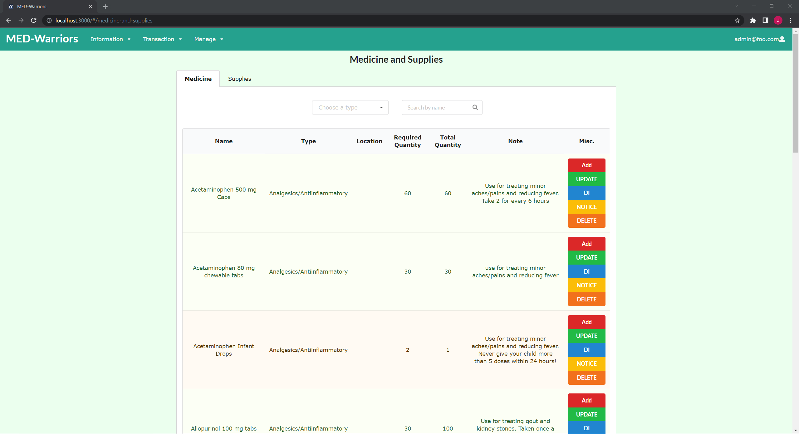
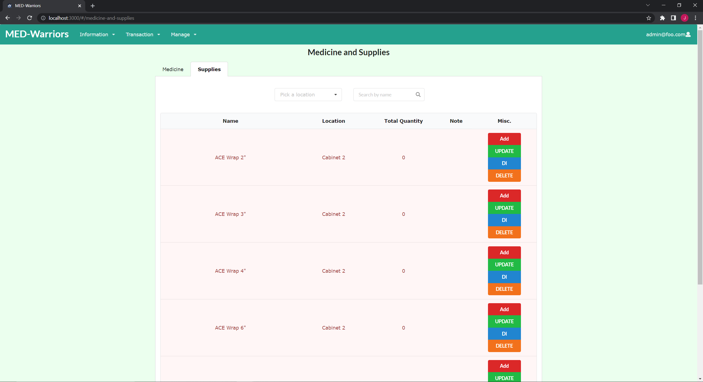
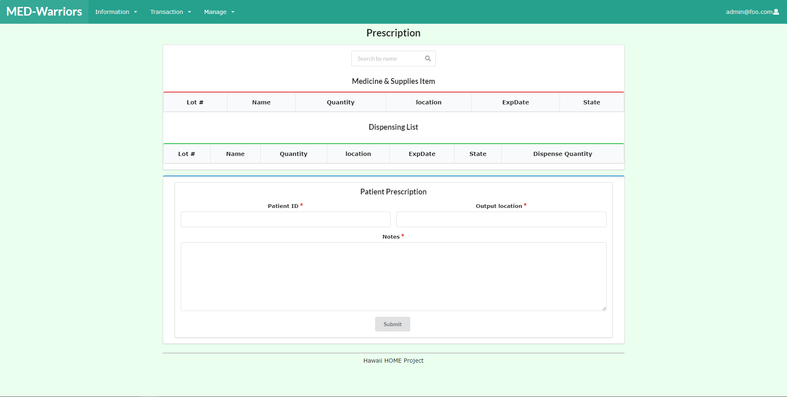

## Table of contents

* [Overview](#overview)
* [Deployment](#deployment)
* [User Guide](#user-guide)
* [Feedback](#feedback)
* [Developer Guide](#developer-guide)
* [Development History](#development-history)
* [Continuous Integration](#continuous-integration)
* [Team](#team)


## Overview
Med-Warriors is a real life application designed for clinics to use to keep track of essential mediciation. 

## Deployment
A live deployment of Med-Warriors is not yet available.

## User Guide
This section provides a walkthrough of the Med-Warriors user interface and its capabilities.

### Landing Page
The landing page is presented to users when they visit the top-level URL to the site.


### Sign in and Sign up
Click on the “Login” button in the upper right corner of the navbar, then select “Sign in” to go to the following page and login. You must have been previously registered with the system to use this option:


You can select “Sign up” to go to the following page and register as a new user:


### Medicine and Supplies Page
This page shows the current stored medicine and supplies with the detailed information.





### User Profile Page
Users have access to his/her personal information of the account, and are able to change/update information and password


### History Records Page
It shows all the changes of medicine and supplies in the storage with the detailed information(input and output).


### Patient Information Page
It shows a record of all patients who visited and have prescriptions, and with full detail of patient information and contact.


### Supplies Source Page
It shows the record of all inputted medicine and supplies with detailed information about the source.


### Input Page
For employees to input the medicine and supplies to storage.


### Prescription Page (Output)
For employees to issue prescriptions of medicine and supplies to patients. Preview of label for bottle. 



### Change Roles Page (Admin)
This is the page where admins of the site can change the roles of other users on the site. There will three roles, an admin, a doctor, and a student. These roles can be changes on this page.


## Feedback
WIP

## Developer Guide
First, [install Meteor](https://www.meteor.com/install):

Second, download a copy of [Med-Warriors](https://github.com/med-warriors/project) from GitHub.

Third, open up your terminal/command prompt and cd into the app directory of the Med-Warriors copy you had just downloaded and install the necessary libraries by invoking meteor npm install:

```
$ meteor npm install
```

Once installed, you can run the application by typing in the command:

```
$ meteor npm run start
```

The first time you run the app, it will create some default users that have been added to the database. Here is an example of how the output might look:


```
I20210916-10:55:21.144(-10)? Creating the default user(s)
I20210916-10:55:21.494(-10)?   Creating user admin@foo.com with role ADMIN.
I20210916-10:55:21.577(-10)? Defining ADMIN admin@foo.com with password changeme
I20210916-10:55:21.584(-10)?   Creating user john@foo.com with role USER.
I20210916-10:55:22.083(-10)? Defining USER john@foo.com with password changeme
I20210916-10:55:22.116(-10)? Creating default data.
I20210916-10:55:22.117(-10)?   Adding: Basket (john@foo.com)
I20210916-10:55:22.259(-10)?   Adding: Bicycle (john@foo.com)
I20210916-10:55:22.263(-10)?   Adding: Banana (admin@foo.com)
I20210916-10:55:22.269(-10)?   Adding: Boogie Board (admin@foo.com)
I20210916-10:55:22.277(-10)? Creating default Profiles.
I20210916-10:55:22.278(-10)?   Adding: John Foo (john@foo.com)
I20210916-10:55:22.410(-10)?   Adding: The Admin (admin@foo.com)
I20210916-10:55:22.419(-10)? Creating default supplies data.
I20210916-10:55:22.420(-10)?   Adding: Aloha 
I20210916-10:55:22.566(-10)?   Adding: John 
I20210916-10:55:22.570(-10)?   Adding: Aaron 
I20210916-10:55:22.575(-10)?   Adding: Mahalo 
I20210916-10:55:22.583(-10)? Creating default patient data.
I20210916-10:55:22.584(-10)?   Adding patient: 2021-09-12T07:30 (John Smith)
I20210916-10:55:22.723(-10)?   Adding patient: 2021-09-12T07:30 (Jane Doe)
I20210916-10:55:22.727(-10)?   Adding patient: 2021-09-13T08:30 (Keanu Reeves)
I20210916-10:55:22.732(-10)?   Adding patient: 2021-09-13T07:30 (Captain America)
I20210916-10:55:22.979(-10)? Monti APM: completed instrumenting the app
=> Started your app.
```

Note regarding bcrypt warning: You might get a similar message when running this application:

```
=> Started proxy.                             
=> Started MongoDB.                           
W20201119-22:58:19.472(-10)? (STDERR) Note: you are using a pure-JavaScript implementation of bcrypt.
W20201119-22:58:19.515(-10)? (STDERR) While this implementation will work correctly, it is known to be
W20201119-22:58:19.516(-10)? (STDERR) approximately three times slower than the native implementation.
W20201119-22:58:19.516(-10)? (STDERR) In order to use the native implementation instead, run
W20201119-22:58:19.516(-10)? (STDERR) 
W20201119-22:58:19.516(-10)? (STDERR)   meteor npm install --save bcrypt
W20201119-22:58:19.516(-10)? (STDERR) 
W20201119-22:58:19.517(-10)? (STDERR) in the root directory of your application.
I20201119-22:58:20.471(-10)? Monti APM: completed instrumenting the app
=> Started your app.
```

If all goes well, the template application will appear at http://localhost:3000.

Finally, you can run ESLint over the code in the imports/directory with this command:

```
$ meteor npm run lint
```

## Development History
The development process for Med-Warriors conformed to [Issue Driven Project Management](http://courses.ics.hawaii.edu/ics314f19/modules/project-management/) practices. In a nutshell:

* Development consists of a sequence of Milestones.
* Each Milestone is specified as a set of tasks.
* Each task is described using a GitHub Issue, and is assigned to a single developer to complete.
* Tasks should typically consist of work that can be completed in 2-4 days.
* The work for each task is accomplished with a git branch named "issue-XX", where XX is replaced by the issue number.
* When a task is complete, its corresponding issue is closed and its corresponding git branch is merged into master.
* The state (todo, in progress, complete) of each task for a milestone is managed using a GitHub Project Board.

The following sections document the development history of Med-Warriors.

### Milestone 1: Mockup development

The goal of Milestone 1 was to create a set of HTML pages providing a mockup of the pages in the system.

Milestone 1 was managed using [Med-Warriors GitHub Project Board M1](https://github.com/med-warriors/project/projects/1):


### Milestone 2: Adding functionality

The goal of Milestone 2 was to create a set of HTML pages with some functionality.

Milestone 2 was managed using [Med-Warriors GitHub Project Board M2](https://github.com/med-warriors/project/projects/2):


### Milestone 3: Adding more functionality

The goal of Milestone 3 was to create a set of HTML pages with some more functionality.

Milestone 3 was managed using [Med-Warriors GitHub Project Board M3](https://github.com/med-warriors/project/projects/4):


## Continuous Integration
WIP

## Team
Med-Warriors is designed, implemented, and maintained by:

* [Tam](https://github.com/tamtn2)
* [Sydney](https://github.com/sydney-c7)
* [Shengtong](https://github.com/ShengT-Jin)
* [Jake U](https://github.com/jakeuyeda)
* [Jin](https://github.com/wjinyan)
* [Daniel N](https://github.com/duhkneelow)
* [Karen](https://github.com/karenwong-kw)
* [Weixiao](https://github.com/wxh23285815)
